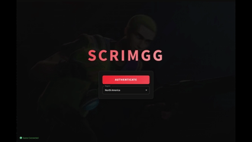
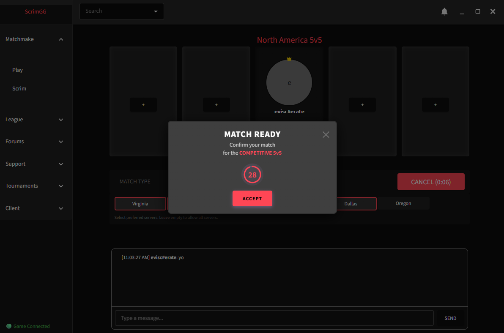
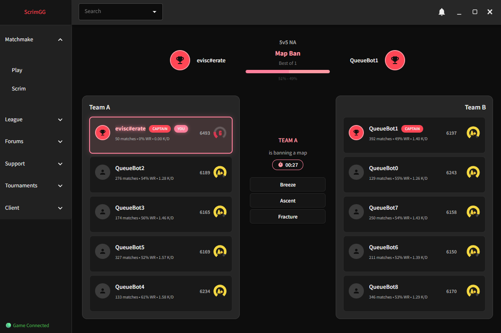
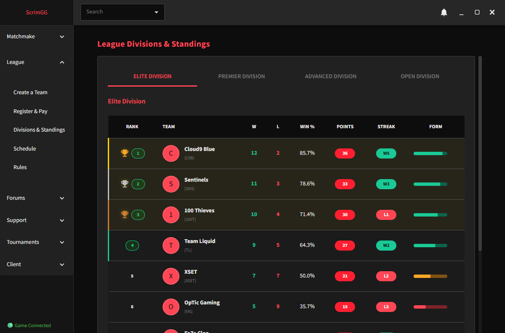
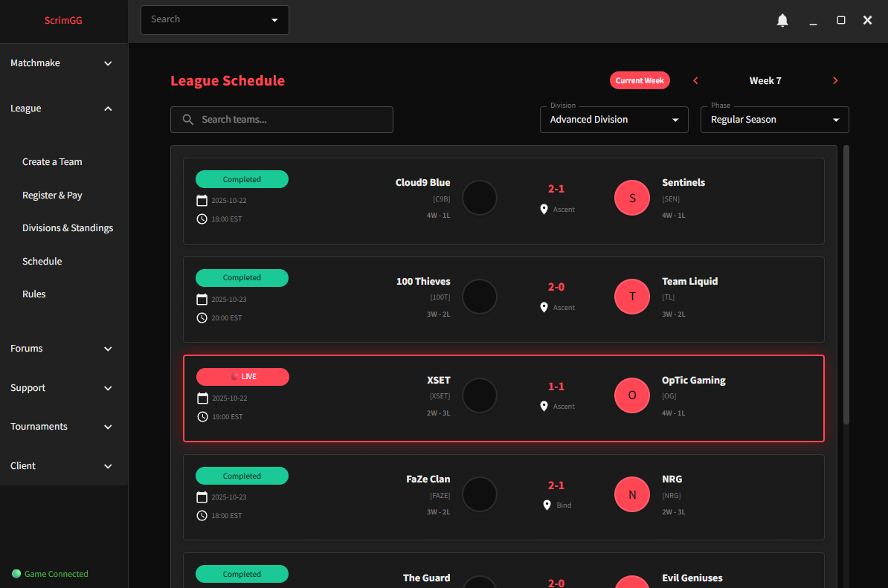
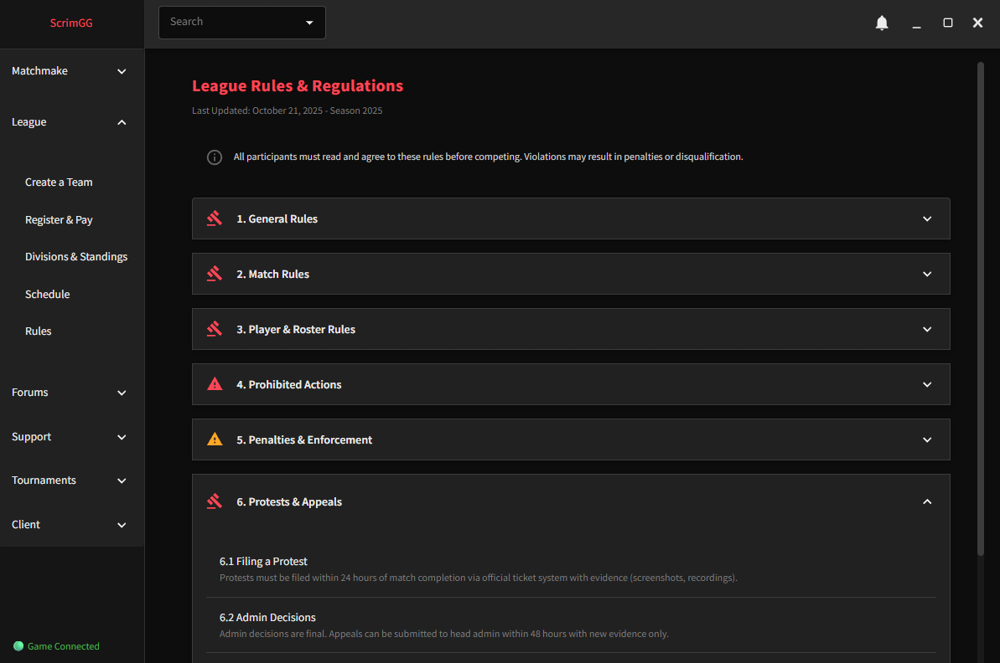
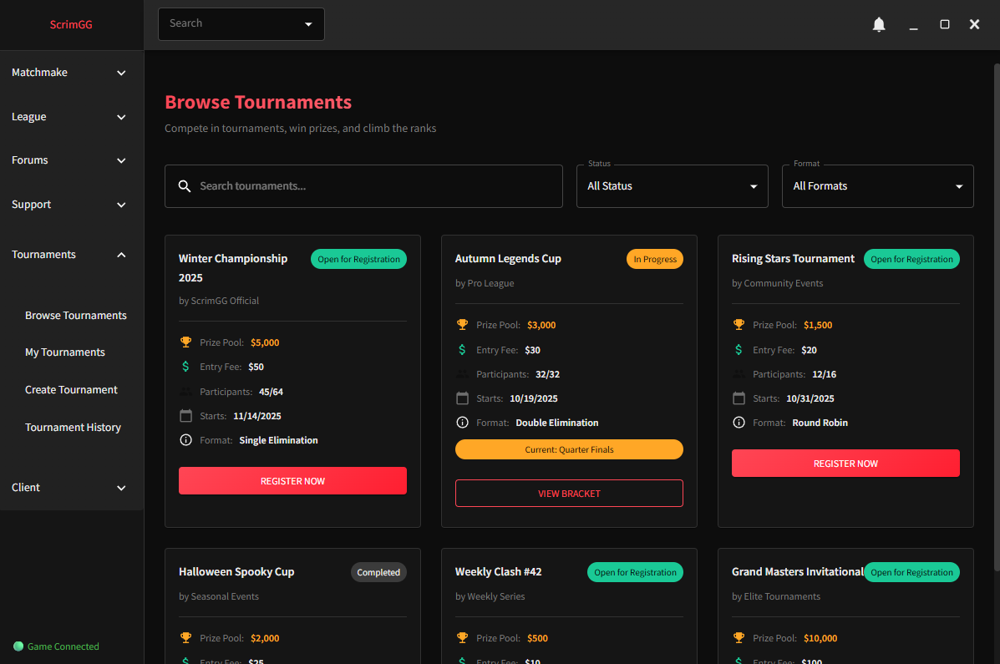
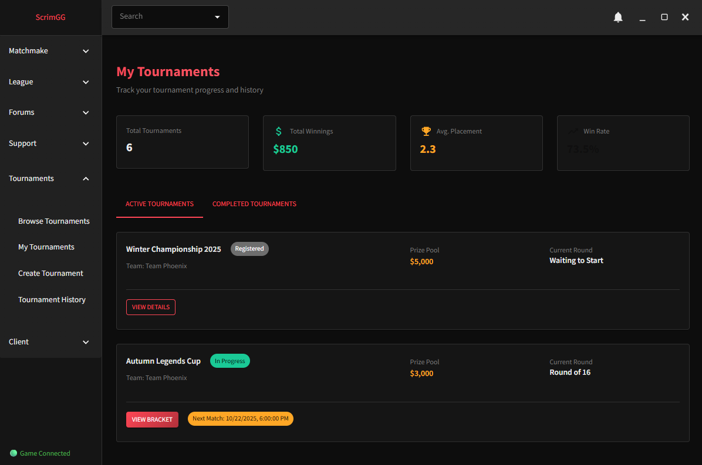
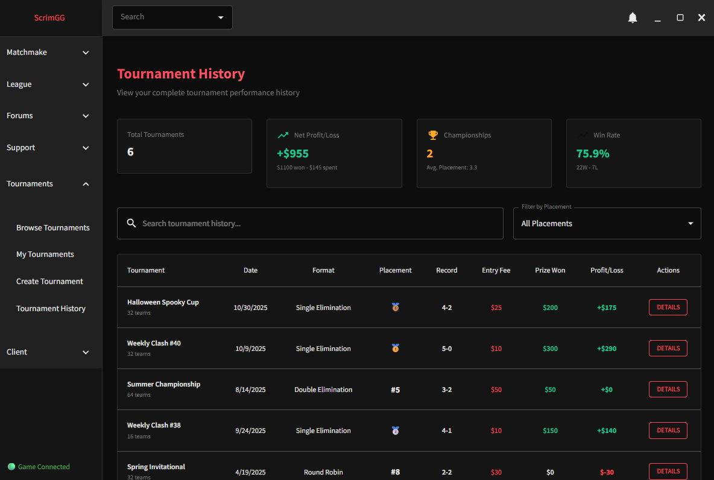

## 🔐 Authorship & Contribution Ledger (Source of Truth)

This section documents the actual engineering ownership of ScrimGG based on system-level and commit-level contribution history.
---

### 🧠 Core System Architecture & Backend (Primary Author)

- Designed full matchmaking system architecture (MMR/ELO + TrueSkill integration)
- Implemented Django backend (server/)
- Built WebSocket infrastructure using Django Channels (Daphne ASGI)
- Designed Redis queueing, caching, and matchmaking state system
- Implemented Celery task system and scheduling pipeline
- Designed PostgreSQL schema and data models
- Built full match lifecycle system (queue → accept → match → results → rating updates)
- Implemented core matchmaking logic and system orchestration
- Developed the majority of frontend UI and application structure outside of explicitly listed contributions

**Primary Author: Myplestory**
---

### 🎨 Frontend / Feature-Level Contributions (Contributor)

The following discrete features were implemented by the contributor:

- Forum WebSocket integration (frontend integration feature)
- Tournament sponsorship functionality
- GSAP animation system for frontend transitions
- Login page rotating video background feature
- Frontend page restructuring and navigation updates
- League system UI module (team creation, standings, schedule, rules)

**Contributor: Twoos123**
---

### ⚙️ Scope Definition (Non-Overlapping Ownership)

- Core backend architecture, matchmaking system, infrastructure, client executable and majority of UI/UX were designed and implemented EXCLUSIVELY by the Primary Author.
- Contributor work consisted of isolated frontend features, UI systems, and integration-level components. NO SYSTEMS WORK WAS DONE BY CONTRIBUTORS.
- NO SHARED AUTHORITY EXISTS ON BACKEND SYSTEMS, MATCHMAKING LOGIC, OR INFRASTRUCTURE AND SYSTEM DESIGN.
---

### 📌 Purpose of This Ledger

This document exists to clearly define engineering ownership of ScrimGG at the system level for transparency and technical accuracy.

# Scrim.GG - Competitive Valorant Matchmaking Platform

<div align="center">


**A third-party competitive matchmaking and scrim service for Valorant, tailored specifically for serious players who want to elevate their gameplay to the next level.**

</div>

---

# Overview

Scrim.GG is a comprehensive matchmaking platform that provides highly engaged players with:
- ELO/MMR-based competitive matchmaking with TrueSkill integration
- Organized 5v5 PUG matches
- Scrim finder and organizer
- Detailed player statistics and rankings
- Real-time lobby chat and communication
- Clans and team support
- Tournament capabilities
- Monthly elo ladders with cash rewards
- Admin support for dispute resolution, player assistance, and fair play
- Karma and social/matchmaking block system for community self governance
- Forums for team recruitment, community growth, and networking for players of all skill levels

### Easily log in with our one click valorant integration

<div align="center">
  
</div>

### Play community pickup games or full 5v5 scrims with ScrimGG with ease

<div align="center">
  
  <br>
  
</div>

### Etch your mark in the community with the official ScrimGG League system, featuring cash prizes and more

<div align="center">
  
  <br>
  
  <br>
  
</div>

### Host your own tournaments, sponsor them, and grow your own community

<div align="center">
  
  <br>
  
  <br>
  
</div>

## Architecture

### 1. Django ASGI Server (`server/`)
- MMR-based matchmaking with time tolerance and priority requeue bias
- Django Channels for WebSocket consumer support
- Redis for caching, queues, state management, and async to sync support
- PostgreSQL database
- Celery for concurrent batched synchronous tasks

### 2. User Client (`client/`)
- ElectronJs Desktop application
- React frontend with Material-UI
- Lightweight ASGI Python backend (Quart)
- WebSocket communication with server
- Valorant local client API

## Quick Start

### Prerequisites

- **Python 3.10+**
- **Node.js 16+**
- **Redis Server**
- **PostgreSQL**
- **Valorant** (for client testing)

### Installation

#### 1. Clone the Repository
```bash
git clone https://github.com/yourusername/scrimgg.git
cd scrimgg
```

#### 2. Server Setup
```bash
cd server
pipenv install
pipenv shell
python manage.py migrate
python manage.py runserver
```

#### 3. Redis (Required)
```bash
# Windows (using WSL or Redis Windows port)
redis-server

# Or use Docker
docker run -d -p 6379:6379 redis
```

#### 4. Client Backend
```bash
cd client/backend
pipenv install
pipenv shell
python bootstrap.py
```

#### 5. Client Frontend
```bash
cd client/frontend
npm install
npm start
```

## Documentation

**[📚 Complete Documentation →](./docs/README.md)**

### Quick Links

| Category | Description |
|----------|-------------|
| **[Architecture](./docs/architecture/)** | System design, matchmaking, and architecture docs |
| **[Client](./docs/Client/)** | Frontend and backend client documentation |
| **[Server](./docs/Server/)** | Server-side app documentation |
| **[Implementation](./docs/implementation/)** | Implementation guides and technical docs |
| **[Testing & Bots](./docs/testing/)** | Bot framework, testing commands |
| **[Troubleshooting](./docs/troubleshooting/)** | Common issues and quick fixes |
| **[Setup Guide](./docs/setup/)** | Installation and configuration |

## Features

### Client Features
- WebSocket-based real-time communication
- Valorant client integration
- Lobby creation and party management
- Real-time chat system
- Player authentication
- Game state monitoring
- Automatic match detection
- Map/server veto system
- Player verification (all 10 joined custom game)
- Automated match result collection
- Post-match ELO/MMR updates
- Comprehensive stats tracking
- Friend system
- Team management
- Tournament system
- Anti-cheat integration
- Admin moderation panel

### Server Features
- Queue system with Redis backend
- MMR/ELO hybrid rating system
- TrueSkill integration for skill estimation
- Time-based matchmaking tolerance
- Match acceptance flow (30s timeout)
- Automatic requeueing on timeout
- Rank-aware matchmaking (5 MMR tiers)

## Tech Stack

### Backend
- **Django 5.0** - Web framework
- **Django Channels** - WebSocket support (via Daphne ASGI server)
- **Redis** - Caching, queues, and channel layer
- **Celery + Beat** - Background tasks and scheduling
- **PostgreSQL** - Primary database
- **TrueSkill** - Skill rating algorithm

### Client
- **Electron** - Desktop app framework
- **React 18** - UI framework
- **Material-UI** - Component library
- **Quart** - Async Python web framework (local backend)
- **valclient** - Valorant local API wrapper

### Infrastructure
- **Daphne** - ASGI server for WebSockets
- **Redis Server** - In-memory data store
- **Docker** (optional) - Containerization
- **Nginx** (production) - Reverse proxy

## Performance

Optimized for running alongside Valorant:

- **Memory Usage:** ~30-50MB (client), ~150-200MB (server)
- **CPU Usage:** <1% idle, ~3% active
- **WebSocket Latency:** ~10-15ms average
- **Matchmaking Speed:** ~10-50ms per run
- **FPS Impact:** <1 frame drop

## Contributing

Contributions are welcome!

1. Fork the repository
2. Create your feature branch (`git checkout -b feature/AmazingFeature`)
3. Commit your changes (`git commit -m 'Add some AmazingFeature'`)
4. Push to the branch (`git push origin feature/AmazingFeature`)
5. Open a Pull Request

See [DEVELOPMENT_SETUP.md](./docs/DEVELOPMENT_SETUP.md) for development environment setup.

## Disclaimer

This is a third-party application and is not affiliated with, endorsed by, or connected to Riot Games. Use at your own risk. This project is for educational purposes.

## License

This project is licensed under the MIT License - see the [LICENSE](LICENSE) file for details.

## Acknowledgments

- Inspired by [FACEIT](https://www.faceit.com)
- Built with [valclient](https://github.com/colinhartigan/valclient-python)
- UI design inspired by ESEA
- TrueSkill algorithm by Microsoft Research

---

<div align="center">

**Made for the Valorant competitive community**

</div>

