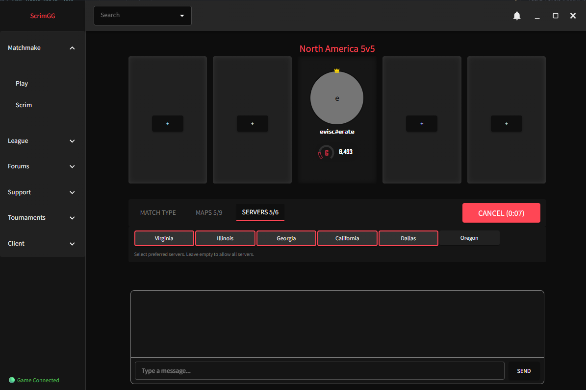
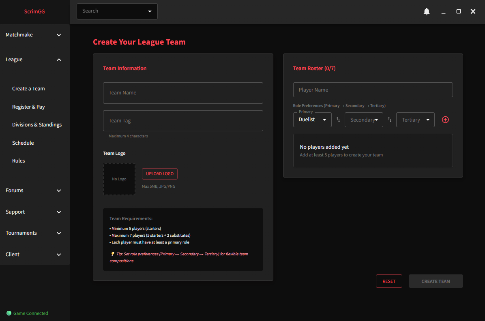
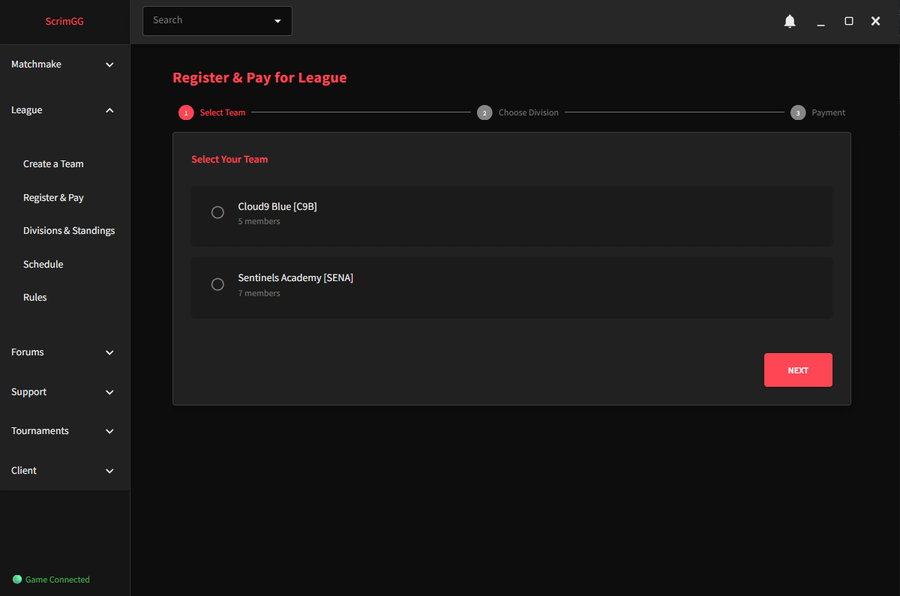
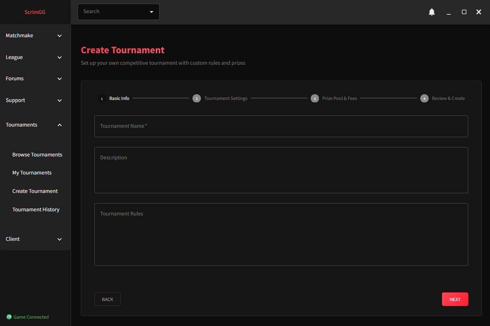

# Scrim.GG - Competitive Valorant Matchmaking Platform

<div align="center">


**A third-party competitive matchmaking and scrim service for Valorant, tailored specifically for serious players who want to elevate their gameplay to the next level.**

</div>

---

## Overview

Scrim.GG is a comprehensive matchmaking platform that provides highly engaged players with:
- ELO/MMR-based competitive matchmaking with TrueSkill integration
- Organized 5v5 PUG matches
- Scrim finder and organizer
- Detailed player statistics and rankings
- Real-time lobby chat and communication
- Clans and team support
- Tournament capabilities
- Monthly elo ladders with cash rewards
- Admin support for dispute resolution, player assistance, and fair play
- Karma and social/matchmaking block system for community self governance
- Forums for team recruitment, community growth, and networking for players of all skill levels

## UI Showcase

**[🖼️ View Interactive Gallery](./docs/gallery.html)** - Browse all UI screenshots with clickable navigation buttons

<style>
  /* Play Gallery Styles */
  .play-carousel {
    position: relative;
    max-width: 100%;
    margin: 20px 0;
    overflow: hidden;
  }
  
  .play-carousel input[type="radio"] {
    display: none;
  }
  
  .play-slides {
    display: flex;
    transition: transform 0.5s ease;
  }
  
  .play-slide {
    min-width: 100%;
    display: none;
    text-align: center;
  }
  
  .play-carousel input[type="radio"]:nth-of-type(1):checked ~ .play-slides .play-slide:nth-of-type(1),
  .play-carousel input[type="radio"]:nth-of-type(2):checked ~ .play-slides .play-slide:nth-of-type(2),
  .play-carousel input[type="radio"]:nth-of-type(3):checked ~ .play-slides .play-slide:nth-of-type(3) {
    display: block;
  }
  
  /* Show/hide prev buttons based on current slide */
  .play-carousel input[type="radio"]:nth-of-type(1):checked ~ .play-controls label[for="play-slide-3"].play-prev,
  .play-carousel input[type="radio"]:nth-of-type(2):checked ~ .play-controls label[for="play-slide-1"].play-prev,
  .play-carousel input[type="radio"]:nth-of-type(3):checked ~ .play-controls label[for="play-slide-2"].play-prev {
    display: inline-block !important;
  }
  
  /* Show/hide next buttons based on current slide */
  .play-carousel input[type="radio"]:nth-of-type(1):checked ~ .play-controls label[for="play-slide-2"].play-next,
  .play-carousel input[type="radio"]:nth-of-type(2):checked ~ .play-controls label[for="play-slide-3"].play-next,
  .play-carousel input[type="radio"]:nth-of-type(3):checked ~ .play-controls label[for="play-slide-1"].play-next {
    display: inline-block !important;
  }
  
  .play-carousel img {
    max-width: 100%;
    height: auto;
    border-radius: 8px;
    box-shadow: 0 4px 20px rgba(0, 0, 0, 0.6);
  }
  
  .play-controls {
    display: flex;
    justify-content: space-between;
    align-items: center;
    margin-top: 15px;
  }
  
  .play-nav {
    background: rgba(255, 70, 85, 0.2);
    border: 2px solid #FF4655;
    color: #FF4655;
    cursor: pointer;
    padding: 10px 20px;
    border-radius: 6px;
    font-size: 16px;
    font-weight: bold;
    transition: all 0.3s ease;
    user-select: none;
    display: none;
  }
  
  .play-prev, .play-next {
    display: none;
  }
  
  .play-nav:hover {
    background: rgba(255, 70, 85, 0.3);
    transform: scale(1.05);
  }
  
  .play-nav:active {
    transform: scale(0.95);
  }
  
  .play-dots {
    display: flex;
    gap: 10px;
    justify-content: center;
  }
  
  .play-dot {
    width: 12px;
    height: 12px;
    border-radius: 50%;
    background: rgba(255, 70, 85, 0.4);
    cursor: pointer;
    transition: all 0.3s ease;
  }
  
  .play-carousel input[type="radio"]:nth-of-type(1):checked ~ .play-controls .play-dot:nth-of-type(1),
  .play-carousel input[type="radio"]:nth-of-type(2):checked ~ .play-controls .play-dot:nth-of-type(2),
  .play-carousel input[type="radio"]:nth-of-type(3):checked ~ .play-controls .play-dot:nth-of-type(3) {
    background: #FF4655;
    transform: scale(1.3);
  }

  /* League Gallery Styles */
  .league-carousel {
    position: relative;
    max-width: 100%;
    margin: 20px 0;
    overflow: hidden;
  }
  
  .league-carousel input[type="radio"] {
    display: none;
  }
  
  .league-slides {
    display: flex;
    transition: transform 0.5s ease;
  }
  
  .league-slide {
    min-width: 100%;
    display: none;
    text-align: center;
  }
  
  .league-carousel input[type="radio"]:nth-of-type(1):checked ~ .league-slides .league-slide:nth-of-type(1),
  .league-carousel input[type="radio"]:nth-of-type(2):checked ~ .league-slides .league-slide:nth-of-type(2),
  .league-carousel input[type="radio"]:nth-of-type(3):checked ~ .league-slides .league-slide:nth-of-type(3),
  .league-carousel input[type="radio"]:nth-of-type(4):checked ~ .league-slides .league-slide:nth-of-type(4),
  .league-carousel input[type="radio"]:nth-of-type(5):checked ~ .league-slides .league-slide:nth-of-type(5) {
    display: block;
  }
  
  /* Show/hide prev buttons based on current slide */
  .league-carousel input[type="radio"]:nth-of-type(1):checked ~ .league-controls label[for="league-slide-5"].league-prev,
  .league-carousel input[type="radio"]:nth-of-type(2):checked ~ .league-controls label[for="league-slide-1"].league-prev,
  .league-carousel input[type="radio"]:nth-of-type(3):checked ~ .league-controls label[for="league-slide-2"].league-prev,
  .league-carousel input[type="radio"]:nth-of-type(4):checked ~ .league-controls label[for="league-slide-3"].league-prev,
  .league-carousel input[type="radio"]:nth-of-type(5):checked ~ .league-controls label[for="league-slide-4"].league-prev {
    display: inline-block !important;
  }
  
  /* Show/hide next buttons based on current slide */
  .league-carousel input[type="radio"]:nth-of-type(1):checked ~ .league-controls label[for="league-slide-2"].league-next,
  .league-carousel input[type="radio"]:nth-of-type(2):checked ~ .league-controls label[for="league-slide-3"].league-next,
  .league-carousel input[type="radio"]:nth-of-type(3):checked ~ .league-controls label[for="league-slide-4"].league-next,
  .league-carousel input[type="radio"]:nth-of-type(4):checked ~ .league-controls label[for="league-slide-5"].league-next,
  .league-carousel input[type="radio"]:nth-of-type(5):checked ~ .league-controls label[for="league-slide-1"].league-next {
    display: inline-block !important;
  }
  
  .league-carousel img {
    max-width: 100%;
    height: auto;
    border-radius: 8px;
    box-shadow: 0 4px 20px rgba(0, 0, 0, 0.6);
  }
  
  .league-controls {
    display: flex;
    justify-content: space-between;
    align-items: center;
    margin-top: 15px;
  }
  
  .league-nav {
    background: rgba(255, 70, 85, 0.2);
    border: 2px solid #FF4655;
    color: #FF4655;
    cursor: pointer;
    padding: 10px 20px;
    border-radius: 6px;
    font-size: 16px;
    font-weight: bold;
    transition: all 0.3s ease;
    user-select: none;
    display: none;
  }
  
  .league-prev, .league-next {
    display: none;
  }
  
  .league-nav:hover {
    background: rgba(255, 70, 85, 0.3);
    transform: scale(1.05);
  }
  
  .league-nav:active {
    transform: scale(0.95);
  }
  
  .league-dots {
    display: flex;
    gap: 10px;
    justify-content: center;
  }
  
  .league-dot {
    width: 12px;
    height: 12px;
    border-radius: 50%;
    background: rgba(255, 70, 85, 0.4);
    cursor: pointer;
    transition: all 0.3s ease;
  }
  
  .league-carousel input[type="radio"]:nth-of-type(1):checked ~ .league-controls .league-dot:nth-of-type(1),
  .league-carousel input[type="radio"]:nth-of-type(2):checked ~ .league-controls .league-dot:nth-of-type(2),
  .league-carousel input[type="radio"]:nth-of-type(3):checked ~ .league-controls .league-dot:nth-of-type(3),
  .league-carousel input[type="radio"]:nth-of-type(4):checked ~ .league-controls .league-dot:nth-of-type(4),
  .league-carousel input[type="radio"]:nth-of-type(5):checked ~ .league-controls .league-dot:nth-of-type(5) {
    background: #FF4655;
    transform: scale(1.3);
  }

  /* Tournament Gallery Styles */
  .tournament-carousel {
    position: relative;
    max-width: 100%;
    margin: 20px 0;
    overflow: hidden;
  }
  
  .tournament-carousel input[type="radio"] {
    display: none;
  }
  
  .tournament-slides {
    display: flex;
    transition: transform 0.5s ease;
  }
  
  .tournament-slide {
    min-width: 100%;
    display: none;
    text-align: center;
  }
  
  .tournament-carousel input[type="radio"]:nth-of-type(1):checked ~ .tournament-slides .tournament-slide:nth-of-type(1),
  .tournament-carousel input[type="radio"]:nth-of-type(2):checked ~ .tournament-slides .tournament-slide:nth-of-type(2),
  .tournament-carousel input[type="radio"]:nth-of-type(3):checked ~ .tournament-slides .tournament-slide:nth-of-type(3),
  .tournament-carousel input[type="radio"]:nth-of-type(4):checked ~ .tournament-slides .tournament-slide:nth-of-type(4) {
    display: block;
  }
  
  /* Show/hide prev buttons based on current slide */
  .tournament-carousel input[type="radio"]:nth-of-type(1):checked ~ .tournament-controls label[for="tournament-slide-4"].tournament-prev,
  .tournament-carousel input[type="radio"]:nth-of-type(2):checked ~ .tournament-controls label[for="tournament-slide-1"].tournament-prev,
  .tournament-carousel input[type="radio"]:nth-of-type(3):checked ~ .tournament-controls label[for="tournament-slide-2"].tournament-prev,
  .tournament-carousel input[type="radio"]:nth-of-type(4):checked ~ .tournament-controls label[for="tournament-slide-3"].tournament-prev {
    display: inline-block !important;
  }
  
  /* Show/hide next buttons based on current slide */
  .tournament-carousel input[type="radio"]:nth-of-type(1):checked ~ .tournament-controls label[for="tournament-slide-2"].tournament-next,
  .tournament-carousel input[type="radio"]:nth-of-type(2):checked ~ .tournament-controls label[for="tournament-slide-3"].tournament-next,
  .tournament-carousel input[type="radio"]:nth-of-type(3):checked ~ .tournament-controls label[for="tournament-slide-4"].tournament-next,
  .tournament-carousel input[type="radio"]:nth-of-type(4):checked ~ .tournament-controls label[for="tournament-slide-1"].tournament-next {
    display: inline-block !important;
  }
  
  .tournament-carousel img {
    max-width: 100%;
    height: auto;
    border-radius: 8px;
    box-shadow: 0 4px 20px rgba(0, 0, 0, 0.6);
  }
  
  .tournament-controls {
    display: flex;
    justify-content: space-between;
    align-items: center;
    margin-top: 15px;
  }
  
  .tournament-nav {
    background: rgba(255, 70, 85, 0.2);
    border: 2px solid #FF4655;
    color: #FF4655;
    cursor: pointer;
    padding: 10px 20px;
    border-radius: 6px;
    font-size: 16px;
    font-weight: bold;
    transition: all 0.3s ease;
    user-select: none;
    display: none;
  }
  
  .tournament-prev, .tournament-next {
    display: none;
  }
  
  .tournament-nav:hover {
    background: rgba(255, 70, 85, 0.3);
    transform: scale(1.05);
  }
  
  .tournament-nav:active {
    transform: scale(0.95);
  }
  
  .tournament-dots {
    display: flex;
    gap: 10px;
    justify-content: center;
  }
  
  .tournament-dot {
    width: 12px;
    height: 12px;
    border-radius: 50%;
    background: rgba(255, 70, 85, 0.4);
    cursor: pointer;
    transition: all 0.3s ease;
  }
  
  .tournament-carousel input[type="radio"]:nth-of-type(1):checked ~ .tournament-controls .tournament-dot:nth-of-type(1),
  .tournament-carousel input[type="radio"]:nth-of-type(2):checked ~ .tournament-controls .tournament-dot:nth-of-type(2),
  .tournament-carousel input[type="radio"]:nth-of-type(3):checked ~ .tournament-controls .tournament-dot:nth-of-type(3),
  .tournament-carousel input[type="radio"]:nth-of-type(4):checked ~ .tournament-controls .tournament-dot:nth-of-type(4) {
    background: #FF4655;
    transform: scale(1.3);
  }
</style>

### Play community pickup games with ScrimGG

<div class="play-carousel">
  <input type="radio" name="play-slider" id="play-slide-1" checked>
  <input type="radio" name="play-slider" id="play-slide-2">
  <input type="radio" name="play-slider" id="play-slide-3">
  
  <div class="play-slides">
    <div class="play-slide">
      
    </div>
    <div class="play-slide">
      
    </div>
    <div class="play-slide">
      
    </div>
  </div>
  
  <div class="play-controls">
    <div>
      <label for="play-slide-3" class="play-prev">← Prev</label>
      <label for="play-slide-2" class="play-prev">← Prev</label>
      <label for="play-slide-1" class="play-prev">← Prev</label>
    </div>
    <div class="play-dots">
      <label for="play-slide-1" class="play-dot"></label>
      <label for="play-slide-2" class="play-dot"></label>
      <label for="play-slide-3" class="play-dot"></label>
    </div>
    <div>
      <label for="play-slide-2" class="play-next">Next →</label>
      <label for="play-slide-3" class="play-next">Next →</label>
      <label for="play-slide-1" class="play-next">Next →</label>
    </div>
  </div>
</div>

### Etch your mark in the community with the official ScrimGG League system, featuring cash prizes and more

<div class="league-carousel">
  <input type="radio" name="league-slider" id="league-slide-1" checked>
  <input type="radio" name="league-slider" id="league-slide-2">
  <input type="radio" name="league-slider" id="league-slide-3">
  <input type="radio" name="league-slider" id="league-slide-4">
  <input type="radio" name="league-slider" id="league-slide-5">
  
  <div class="league-slides">
    <div class="league-slide">
      
    </div>
    <div class="league-slide">
      
    </div>
    <div class="league-slide">
      
    </div>
    <div class="league-slide">
      
    </div>
    <div class="league-slide">
      
    </div>
  </div>
  
  <div class="league-controls">
    <div>
      <label for="league-slide-5" class="league-prev">← Prev</label>
      <label for="league-slide-1" class="league-prev">← Prev</label>
      <label for="league-slide-2" class="league-prev">← Prev</label>
      <label for="league-slide-3" class="league-prev">← Prev</label>
      <label for="league-slide-4" class="league-prev">← Prev</label>
    </div>
    <div class="league-dots">
      <label for="league-slide-1" class="league-dot"></label>
      <label for="league-slide-2" class="league-dot"></label>
      <label for="league-slide-3" class="league-dot"></label>
      <label for="league-slide-4" class="league-dot"></label>
      <label for="league-slide-5" class="league-dot"></label>
    </div>
    <div>
      <label for="league-slide-2" class="league-next">Next →</label>
      <label for="league-slide-3" class="league-next">Next →</label>
      <label for="league-slide-4" class="league-next">Next →</label>
      <label for="league-slide-5" class="league-next">Next →</label>
      <label for="league-slide-1" class="league-next">Next →</label>
    </div>
  </div>
</div>

### Host your own tournaments, sponsor them, and grow your own community

<div class="tournament-carousel">
  <input type="radio" name="tournament-slider" id="tournament-slide-1" checked>
  <input type="radio" name="tournament-slider" id="tournament-slide-2">
  <input type="radio" name="tournament-slider" id="tournament-slide-3">
  <input type="radio" name="tournament-slider" id="tournament-slide-4">
  
  <div class="tournament-slides">
    <div class="tournament-slide">
      
    </div>
    <div class="tournament-slide">
      
    </div>
    <div class="tournament-slide">
      
    </div>
    <div class="tournament-slide">
      
    </div>
  </div>
  
  <div class="tournament-controls">
    <div>
      <label for="tournament-slide-4" class="tournament-prev">← Prev</label>
      <label for="tournament-slide-1" class="tournament-prev">← Prev</label>
      <label for="tournament-slide-2" class="tournament-prev">← Prev</label>
      <label for="tournament-slide-3" class="tournament-prev">← Prev</label>
    </div>
    <div class="tournament-dots">
      <label for="tournament-slide-1" class="tournament-dot"></label>
      <label for="tournament-slide-2" class="tournament-dot"></label>
      <label for="tournament-slide-3" class="tournament-dot"></label>
      <label for="tournament-slide-4" class="tournament-dot"></label>
    </div>
    <div>
      <label for="tournament-slide-2" class="tournament-next">Next →</label>
      <label for="tournament-slide-3" class="tournament-next">Next →</label>
      <label for="tournament-slide-4" class="tournament-next">Next →</label>
      <label for="tournament-slide-1" class="tournament-next">Next →</label>
    </div>
  </div>
</div>

## Architecture

### 1. Django ASGI Server (`server/`)
- MMR-based matchmaking with time tolerance and priority requeue bias
- Django Channels for WebSocket consumer support
- Redis for caching, queues, state management, and async to sync support
- PostgreSQL database
- Celery for concurrent batched synchronous tasks

### 2. User Client (`client/`)
- ElectronJs Desktop application
- React frontend with Material-UI
- Lightweight ASGI Python backend (Quart)
- WebSocket communication with server
- Valorant local client API

## Quick Start

### Prerequisites

- **Python 3.10+**
- **Node.js 16+**
- **Redis Server**
- **PostgreSQL**
- **Valorant** (for client testing)

### Installation

#### 1. Clone the Repository
```bash
git clone https://github.com/yourusername/scrimgg.git
cd scrimgg
```

#### 2. Server Setup
```bash
cd server
pipenv install
pipenv shell
python manage.py migrate
python manage.py runserver
```

#### 3. Redis (Required)
```bash
# Windows (using WSL or Redis Windows port)
redis-server

# Or use Docker
docker run -d -p 6379:6379 redis
```

#### 4. Client Backend
```bash
cd client/backend
pipenv install
pipenv shell
python bootstrap.py
```

#### 5. Client Frontend
```bash
cd client/frontend
npm install
npm start
```

## Documentation

**[📚 Complete Documentation →](./docs/README.md)**

### Quick Links

| Category | Description |
|----------|-------------|
| **[Architecture](./docs/architecture/)** | System design, matchmaking, and architecture docs |
| **[Client](./docs/Client/)** | Frontend and backend client documentation |
| **[Server](./docs/Server/)** | Server-side app documentation |
| **[Implementation](./docs/implementation/)** | Implementation guides and technical docs |
| **[Testing & Bots](./docs/testing/)** | Bot framework, testing commands |
| **[Troubleshooting](./docs/troubleshooting/)** | Common issues and quick fixes |
| **[Setup Guide](./docs/setup/)** | Installation and configuration |

## Features

### Client Features
- WebSocket-based real-time communication
- Valorant client integration
- Lobby creation and party management
- Real-time chat system
- Player authentication
- Game state monitoring
- Automatic match detection
- Map/server veto system
- Player verification (all 10 joined custom game)
- Automated match result collection
- Post-match ELO/MMR updates
- Comprehensive stats tracking
- Friend system
- Team management
- Tournament system
- Anti-cheat integration
- Admin moderation panel

### Server Features
- Queue system with Redis backend
- MMR/ELO hybrid rating system
- TrueSkill integration for skill estimation
- Time-based matchmaking tolerance
- Match acceptance flow (30s timeout)
- Automatic requeueing on timeout
- Rank-aware matchmaking (5 MMR tiers)

## Tech Stack

### Backend
- **Django 5.0** - Web framework
- **Django Channels** - WebSocket support (via Daphne ASGI server)
- **Redis** - Caching, queues, and channel layer
- **Celery + Beat** - Background tasks and scheduling
- **PostgreSQL** - Primary database
- **TrueSkill** - Skill rating algorithm

### Client
- **Electron** - Desktop app framework
- **React 18** - UI framework
- **Material-UI** - Component library
- **Quart** - Async Python web framework (local backend)
- **valclient** - Valorant local API wrapper

### Infrastructure
- **Daphne** - ASGI server for WebSockets
- **Redis Server** - In-memory data store
- **Docker** (optional) - Containerization
- **Nginx** (production) - Reverse proxy

## Performance

Optimized for running alongside Valorant:

- **Memory Usage:** ~30-50MB (client), ~150-200MB (server)
- **CPU Usage:** <1% idle, ~3% active
- **WebSocket Latency:** ~10-15ms average
- **Matchmaking Speed:** ~10-50ms per run
- **FPS Impact:** <1 frame drop

## Contributing

Contributions are welcome!

1. Fork the repository
2. Create your feature branch (`git checkout -b feature/AmazingFeature`)
3. Commit your changes (`git commit -m 'Add some AmazingFeature'`)
4. Push to the branch (`git push origin feature/AmazingFeature`)
5. Open a Pull Request

See [DEVELOPMENT_SETUP.md](./docs/DEVELOPMENT_SETUP.md) for development environment setup.

## Development Status

| Component | Status | Progress |
|-----------|--------|----------|
| WebSocket Communication | ✅ Complete | 100% |
| Lobby System | ✅ Complete | 100% |
| Chat System | ✅ Complete | 100% |
| Queue System | ✅ Complete | 100% |
| **Matchmaking (MMR/ELO)** | ✅ Complete | 100% |
| **Match Acceptance Flow** | ✅ Complete | 100% |
| **Requeueing System** | ✅ Complete | 100% |
| Game Monitor | 🚧 In Progress | 40% |
| Match Coordinator | 🚧 In Progress | 30% |
| Veto System | 📋 Planned | 0% |
| Post-Match Stats/Updates | 📋 Planned | 0% |

**Current Focus:** Game state monitoring and custom game coordination

## Disclaimer

This is a third-party application and is not affiliated with, endorsed by, or connected to Riot Games. Use at your own risk. This project is for educational purposes.

## License

This project is licensed under the MIT License - see the [LICENSE](LICENSE) file for details.

## Acknowledgments

- Inspired by [FACEIT](https://www.faceit.com)
- Built with [valclient](https://github.com/colinhartigan/valclient-python)
- UI design inspired by ESEA
- TrueSkill algorithm by Microsoft Research

---

<div align="center">

**Made for the Valorant competitive community**

</div>

